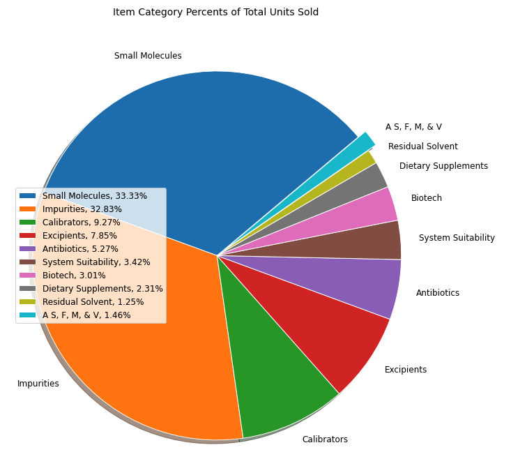
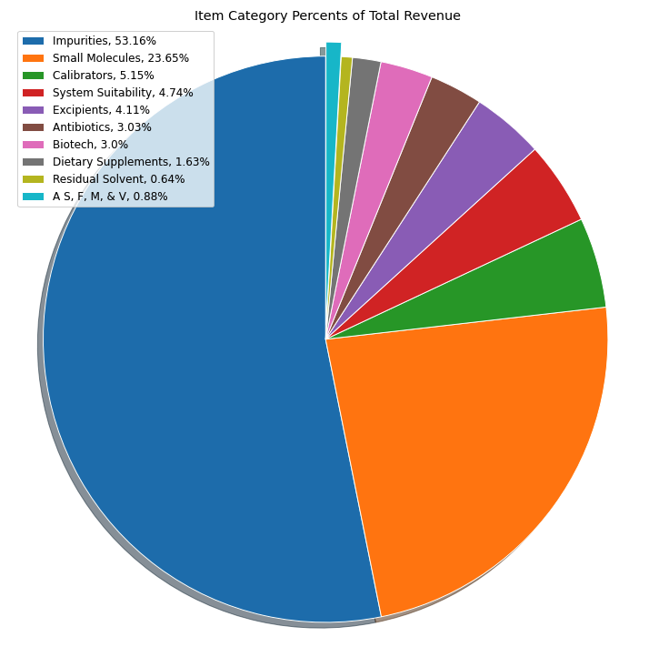
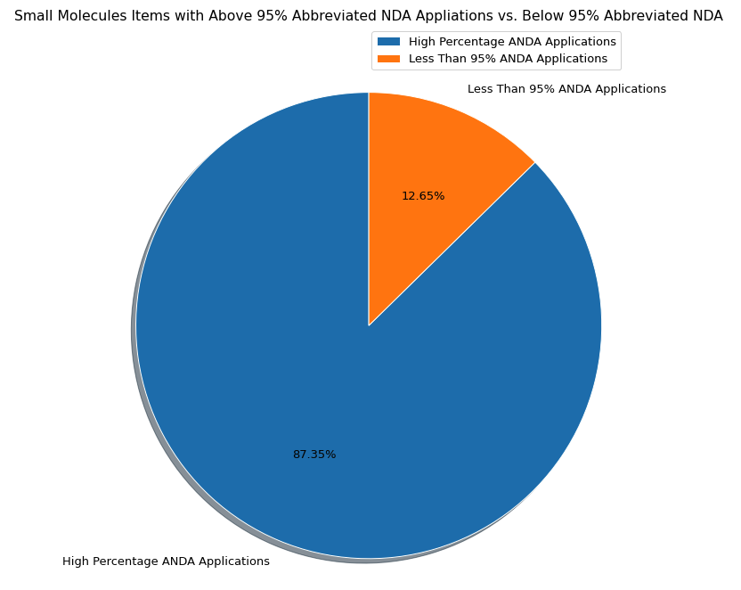

# Data-Exploration-Case-Study

Using sales data ("VW_SALES_DIST_DETAILS.xlsx") and pharmaceutical product data ("products.txt"), patterns and trends were discovered through data mining.  After grouping sales by 'Item Category', the categories with the highest average revenues, average units sold, and average revenue per unit were identified after engineering these features from the provided features.  Because several item categories were repeated in the highest averages lists, those were the initial focus of exploration.

Even though Biotech is a relatively smaller share of the total revenue generated by the company, it has higher average revenues, units sold and revenue per unit when compared to other categories.  Calibrators, Small Molecules, Impurities, and System Suitability were also top earning categories, but this could be expected because they represent a larger portion of total unit sales and revenue for the company.  When exploring the category Biotech specifically, late spring/ early summer and late fall/ early winter months tended to have higher revenues and unit sales when compared to other months. 

The relationship between products identified as small molecules and drug application types was also explored after the sales data and product datasets were joined.  The overwhelming majority of Small Molecules items sold had nearly all Abbreviated NDA (ANDA) applications. As seen in the chart below, more than 87% of the items sold had ANDA applications submitted at least 95% of the time.

